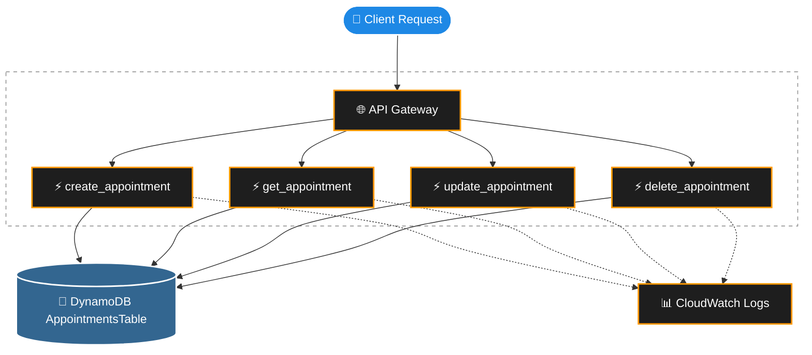

# AWS Serverless Appointment System

A production-grade serverless REST API for appointment management, built on AWS and managed 100% with Terraform.

---

## Problem Statement

Small clinics and service businesses across Latin America rely on WhatsApp to manage bookings manually — a process with no confirmation system, no audit trail, and significant booking loss. This project delivers a scalable, cost-efficient backend API to replace that workflow.

---

## Architecture

**Pattern:** Microservices — one Lambda per CRUD operation, each with its own isolated IAM role.


---

## Infrastructure State

### ✅ Deployed & Validated

| Layer      | Resource                   | Details                                                    |
| :--------- | :------------------------- | :--------------------------------------------------------- |
| Network    | API Gateway REST API       | Handles routing and payload proxying                       |
| Database   | `appointments_table`       | DynamoDB, single-table design, pay-per-request             |
| Security   | `lambda_appointments_role` | 1 IAM Role with strict PoLP — DynamoDB + CloudWatch only   |
| Compute    | `create_appointment`       | Lambda, Python 3.9, `.zip` package                         |
| Compute    | `get_appointment`          | Lambda, Python 3.9, `.zip` package                         |
| Compute    | `update_appointment`       | Lambda, Python 3.9, `.zip` package                         |
| Compute    | `delete_appointment`       | Lambda, Python 3.9, `.zip` package                         |
| Monitoring | CloudWatch Log Groups (×4) | One per Lambda, 14-day retention policy                    |

---

## Architecture Evolution: From Fat Lambda to Microservices

Initially, this project started as a single "Fat Lambda" (`legacy_v1/lambda_function.py`) handling all CRUD operations. While functional for early prototyping, I decided to refactor the architecture into independent microservices managed by Terraform. 

This evolution allowed me to:
- **Improve Cold Starts**: Smaller, focused Lambda packages.
- **Enforce Least Privilege (PoLP)**: Each Lambda now has an IAM role restricted to only the specific DynamoDB action it needs (e.g., `dynamodb:PutItem` vs `dynamodb:GetItem`).
- **Improve Maintainability**: Independent deployments and isolated failure domains.

---

## Tech Decisions

| Component | Choice                 | Rejected          | Reason                                                                    |
| :-------- | :--------------------- | :---------------- | :------------------------------------------------------------------------ |
| Database  | DynamoDB               | RDS / MySQL       | No joins required. Single-digit ms latency. Pay-per-request cost model.   |
| Compute   | Lambda (microservices) | EC2 / Fat Lambda  | Sporadic traffic. Isolated failures. Per-function cold start tuning.      |
| IaC       | Terraform              | AWS Console / SAM | Reproducible. Version-controlled. Prevents architectural drift.           |
| Runtime   | Python 3.9             | Node.js           | boto3 is idiomatic. Strong AWS SDK support.                               |

---

## Security Model

- Each Lambda function has its own **isolated IAM Role** — no shared credentials.
- **Strict Principle of Least Privilege (PoLP):**
  - `create_appointment` → `dynamodb:PutItem` only
  - `get_appointment` → `dynamodb:GetItem` only
  - `update_appointment` → `dynamodb:UpdateItem` only
  - `delete_appointment` → `dynamodb:DeleteItem` only
- All roles include `logs:CreateLogGroup`, `logs:CreateLogStream`, `logs:PutLogEvents` for CloudWatch.
- No hardcoded credentials. All identity managed via AWS IAM and Terraform.

---

## Application Logic

Lambdas are built for **API Gateway Proxy Integration**. The event payload must be a JSON string nested under a `"body"` key.

**Required fields (validated before any DynamoDB write):**

| Field              | Type   | Notes                    |
| :----------------- | :----- | :----------------------- |
| `patient_name`     | string | Full name of the patient |
| `doctor_name`      | string | Full name of the doctor  |
| `appointment_date` | string | Format: `YYYY-MM-DD`     |
| `appointment_time` | string | Format: `HH:MM`          |

> `appointment_id` is auto-generated by the Lambda using a timestamp (`APT-YYYYMMDDHHMMSS`). Do not include it in the request.

**Example payload:**
```json
{
  "body": "{\"patient_name\": \"Ana Torres\", \"doctor_name\": \"Dr. Vega\", \"appointment_date\": \"2026-03-15\", \"appointment_time\": \"10:00\"}"
}
```

Missing or unknown fields return `400 Bad Request`.

---

## Deployment
```bash
terraform init
terraform plan
terraform apply
```

**Validate a Lambda directly via AWS CLI (current testing method):**
```bash
aws lambda invoke \
  --function-name create_appointment \
  --payload '{"body": "{\"patient_name\": \"Ana Torres\", \"doctor_name\": \"Dr. Vega\", \"appointment_date\": \"2026-03-15\", \"appointment_time\": \"10:00\"}"}' \
  --cli-binary-format raw-in-base64-out \
  response.json && cat response.json
```

> Note: requires AWS CLI configured with access to the deployment account.

---

## Terraform File Map
```
terraform/
├── main.tf            ✅ Provider config, backend
├── dynamodb.tf        ✅ appointments_table
├── iam.tf             ✅ lambda_appointments_role + policy
├── lambda.tf          ✅ 4 Lambda functions + CloudWatch Log Groups
└── api_gateway.tf     ✅ REST API + Routes
```

---

## Roadmap

- [x] DynamoDB table (single-table design)
- [x] IAM roles — strict PoLP per Lambda
- [x] Lambda CRUD functions (Python 3.9, microservices pattern)
- [x] CloudWatch Log Groups with 14-day retention
- [x] Data and compute layers validated via AWS CLI
- [x] API Gateway — REST API + routes + Lambda integration
- [x] `aws_lambda_permission` for API Gateway invocation
- [x] End-to-end HTTP testing

---

## Author

**Nicolás Ibañez** — Civil Engineering in Informatics, Universidad Andrés Bello  
[github.com/nicolas-ibanez/aws-serverless-appointment-system](https://github.com/nicolas-ibanez/aws-serverless-appointment-system)